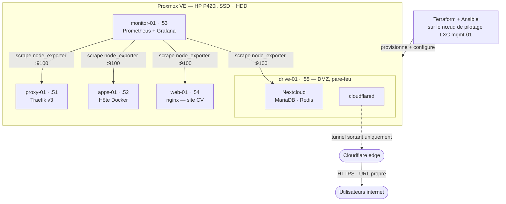

# Homelab Proxmox — Infrastructure as Code

[🇬🇧 English version](README.md)


Infrastructure as Code de bout en bout pour mon homelab Proxmox : **Terraform** provisionne les machines virtuelles, **Ansible** les configure, les durcit et déploie les services. Un `terraform apply` + un `ansible-playbook` et tout l'environnement existe — reproductible, versionné, destructible à volonté. Il héberge même un cloud auto-hébergé, isolé en DMZ et exposé sur internet via un tunnel Cloudflare, sans aucun port ouvert.

## Architecture



Le disque système du drive est sur le SSD (thin-LVM), tandis que son volume de données de 700 Go est sur un HDD séparé — déclaré dans Terraform comme un `data_disk` optionnel par VM.

## Ce que ça fait

**Terraform** (`terraform/`)
- Clone un template cloud-init en VMs (`for_each` sur une seule map `vms` — ajouter une machine = quelques lignes)
- **Flavors** façon OpenStack (`m1.small` / `m1.medium` / `m1.large`) : chaque VM référence un gabarit au lieu de coder ses ressources en dur
- **Second disque de données** optionnel sur un autre stockage (SSD pour l'OS, HDD pour le volume)
- **DMZ** optionnelle : active le pare-feu Proxmox sur la carte de la VM avec des règles dédiées — entrées limitées (web / SSH depuis mgmt / métriques), **sorties vers le LAN interdites** pour qu'une VM compromise ne puisse pas rebondir
- Suit les [recommandations du provider bpg/proxmox](https://registry.terraform.io/providers/bpg/proxmox/latest/docs) : type CPU `x86-64-v2-AES`, agent intégré au template
- IPs statiques, injection de clé SSH et création d'utilisateur via cloud-init — aucune étape manuelle, aucun mot de passe
- **Génère l'inventaire Ansible** (`local_file` + `templatefile`) : Terraform et Ansible sont toujours d'accord sur les machines qui existent

**Ansible** (`ansible/`)
- `common` — paquets de base, timezone, qemu-guest-agent (démarré seulement si le périphérique virtio est présent)
- `hardening` — SSH par clé uniquement, pas de login root, UFW (deny par défaut) avec ports par groupe, fail2ban, mises à jour de sécurité auto
- `node_exporter` — endpoint de métriques sur chaque VM
- `docker` — Docker Engine + plugin Compose depuis le dépôt officiel
- `traefik` — reverse proxy dont la config est templatée depuis l'inventaire
- `monitoring` — Prometheus + Grafana via Docker Compose ; la config de scrape est **templatée depuis l'inventaire** : chaque nouvelle VM est supervisée automatiquement
- `cv_site` — nginx qui sert mon CV derrière Traefik ; le PDF est déployé par Ansible mais ignoré par git
- `drive` — partitionne et monte le disque HDD, puis déploie **Nextcloud** (MariaDB + cache Redis + cron dédié) et **cloudflared** pour l'accès public ; `trusted_domains` / overwrite appliqués de façon idempotente via `occ`

**CI** (`.github/workflows/ci.yml`)
- `terraform fmt` + `terraform validate` et `ansible-lint` à chaque push

## Démarrage rapide

```bash
# 0. Préparation Proxmox (token API + template cloud-init), une seule fois : voir docs/proxmox-setup.md

# 1. Provisionner les VMs
cd terraform
cp terraform.tfvars.example terraform.tfvars   # renseigner endpoint + token
terraform init
terraform apply

# 2. Tout configurer (les secrets restent hors de git, voir ansible/secrets.yml.example)
cd ../ansible
ansible-galaxy collection install -r requirements.yml
ansible-playbook site.yml -e @secrets.yml
```

Puis ouvrir Grafana sur `http://192.168.213.53:3000` (ou `grafana.lab.local` via Traefik).

## Ajouter une VM en 30 secondes

```bash
./scripts/newvm.sh add       # interactif : nom, id, groupe, flavor, IP, disque data, DMZ
./scripts/newvm.sh list
./scripts/newvm.sh remove <nom>
```

Le script maintient `terraform/vms.auto.tfvars.json` (chargé automatiquement par
Terraform, remplace la map `vms` par défaut) et propose d'enchaîner
`terraform apply` puis un run Ansible **ciblé** (`--limit nouvelle-vm,monitoring,proxy`),
pour qu'ajouter une machine reste rapide quel que soit le nombre d'hôtes. La
nouvelle VM est clonée, durcie, reçoit Docker et apparaît dans Prometheus/Grafana
— sans toucher un seul fichier à la main.

## Sécurité

- **Isolation DMZ** — la VM du drive, exposée à internet, est pare-feutée au
  niveau de Proxmox (hors de la VM, donc valable même si la VM est compromise) :
  entrées limitées au strict nécessaire, sorties vers le LAN bloquées — une
  compromission du drive ne peut pas atteindre les autres machines.
- **Aucun port ouvert en entrée** — le drive est publié via un tunnel Cloudflare
  (connexion sortante uniquement) ; l'IP maison reste cachée et il n'y a aucune
  redirection de port à attaquer. Le TLS est terminé chez Cloudflare.
- **Durci par défaut** — SSH par clé, pas de root, UFW deny par défaut, fail2ban
  et mises à jour de sécurité automatiques sur chaque VM.
- **Vérifié de l'extérieur** — le Nextcloud exposé obtient **A+** au
  [scan officiel Nextcloud](https://scan.nextcloud.com), **A+** chez
  [Qualys SSL Labs](https://www.ssllabs.com/ssltest/) et **A+** sur
  securityheaders.com (HSTS, CSP, cookies sécurisés, 2FA imposée).

## Leçons apprises

De vrais problèmes résolus pendant la construction — le debugging fait la moitié de la valeur :

- **Le contrôleur RAID figeait les écritures.** Quatre full clones en parallèle
  ont bloqué la carte HP Smart Array P420i. Cause : l'array SSD avait
  **HPE SSD Smart Path** activé avec le cache d'écriture désactivé, chaque
  écriture allait droit au disque. Corrigé avec `ssacli`
  (`ssdsmartpath=disable`, `arrayaccelerator=enable`) ; passage aux
  **linked clones** (quelques secondes au lieu de 15+ minutes par VM).
- **Une règle NAT parasite faussait le filtrage par source.** La règle DMZ
  « autoriser SSH depuis mgmt » rejetait le trafic. Le log du pare-feu montrait
  les paquets arrivant avec l'IP *de l'hôte* : un `POSTROUTING ... MASQUERADE`
  résiduel dans `/etc/iptables/rules.v4` réécrivait la source de tout paquet
  ponté. Sa suppression a rétabli le filtrage correct.
- **Un certificat sans port 80 ouvert.** Le FAI bloque le HTTP entrant et le VPN
  du routeur occupe déjà le 443 : les défis ACME HTTP-01 et TLS-ALPN-01 échouent
  tous les deux. La réponse : le **défi DNS-01**, puis finalement un **tunnel
  Cloudflare** — une URL publique propre sans aucune redirection de port.

## Arborescence

```
├── scripts/              # newvm.sh — ajout/suppression/listing interactif de VMs
├── terraform/            # Provisionnement + pare-feu DMZ par VM (bpg/proxmox)
│   └── templates/        # Template de l'inventaire Ansible
├── ansible/
│   ├── site.yml          # point d'entrée
│   ├── secrets.yml.example
│   └── roles/            # common, hardening, node_exporter, docker,
│                         #   traefik, monitoring, cv_site, drive
├── docs/                 # Préparation Proxmox, bonnes pratiques, captures
└── .github/workflows/    # CI : terraform validate + ansible-lint
```

## Le lab en images

Les VMs provisionnées par Terraform, avec leurs tags et l'IP remontée par l'agent :


Chaque VM est supervisée automatiquement — la config Prometheus est templatée depuis l'inventaire :


Les métriques Node Exporter dans Grafana (dashboard 1860) :


Le routage Traefik et la page CV servie par `web-01` :


## Bonnes pratiques

Les conventions que ce lab suit (source de vérité unique, runs Ansible ciblés, règles de replace, exposition/DMZ, leçons stockage) : [docs/best-practices.fr.md](docs/best-practices.fr.md)

## Feuille de route

- [x] Provisionnement Terraform + configuration Ansible de bout en bout, avec CI
- [x] Flavors façon OpenStack et un script d'ajout de VM en une commande
- [x] Drive auto-hébergé (Nextcloud) en DMZ, exposé via tunnel Cloudflare
- [ ] Build du template cloud-init avec Packer (remplacer les commandes `qm` manuelles)
- [ ] Gérer les réglages Cloudflare (TLS, HSTS, WAF) avec le provider Terraform Cloudflare
- [ ] Alerting (Alertmanager → webhook Discord)
- [ ] Sauvegardes avec Proxmox Backup Server
