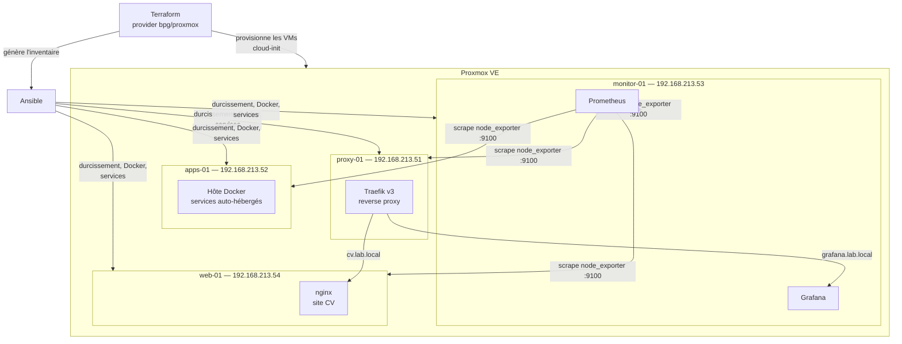

# Homelab Proxmox — Infrastructure as Code

[🇬🇧 English version](README.md)


Infrastructure as Code de bout en bout pour mon homelab Proxmox : **Terraform** provisionne les machines virtuelles, **Ansible** les configure, les durcit et déploie les services. Un `terraform apply` + un `ansible-playbook` et tout l'environnement existe — reproductible, versionné, destructible à volonté.

## Architecture



## Ce que ça fait

**Terraform** (`terraform/`)
- Clone un template cloud-init en 4 VMs (`for_each` sur une seule map `vms` — ajouter une machine = 6 lignes de HCL)
- **Flavors** façon OpenStack (`m1.small` / `m1.medium` / `m1.large`) : chaque VM référence un gabarit de ressources au lieu de les coder en dur
- Suit les [recommandations du provider bpg/proxmox](https://registry.terraform.io/providers/bpg/proxmox/latest/docs) : type CPU `x86-64-v2-AES`, `stop_on_destroy` pour les VMs sans guest agent
- IPs statiques, injection de clé SSH et création d'utilisateur via cloud-init — aucune étape manuelle, aucun mot de passe
- **Génère l'inventaire Ansible** (`local_file` + `templatefile`) : Terraform et Ansible sont toujours d'accord sur les machines qui existent

**Ansible** (`ansible/`)
- `common` — paquets de base, timezone, qemu-guest-agent
- `hardening` — SSH par clé uniquement, pas de login root, UFW (deny par défaut) avec ports par groupe, fail2ban, mises à jour de sécurité automatiques
- `node_exporter` — endpoint de métriques sur chaque VM
- `docker` — Docker Engine + plugin Compose depuis le dépôt officiel
- `traefik` — reverse proxy dont la config est templatée depuis l'inventaire
- `monitoring` — Prometheus + Grafana via Docker Compose ; la config de scrape est **templatée depuis l'inventaire** : chaque nouvelle VM est supervisée automatiquement
- `cv_site` — nginx qui sert mon CV derrière Traefik (`cv.lab.local`) ; le PDF est déployé par Ansible mais ignoré par git

**CI** (`.github/workflows/ci.yml`)
- `terraform fmt` + `terraform validate` et `ansible-lint` à chaque push

## Démarrage rapide

```bash
# 0. Préparation Proxmox (token API + template cloud-init), une seule fois : voir docs/proxmox-setup.md

# 1. Provisionner les VMs
cd terraform
cp terraform.tfvars.example terraform.tfvars   # renseigner endpoint + token
terraform init
terraform apply

# 2. Tout configurer
cd ../ansible
ansible-galaxy collection install -r requirements.yml
ansible-playbook site.yml
```

Puis ouvrir Grafana sur `http://192.168.213.53:3000` (ou `grafana.lab.local` via Traefik).

## Ajouter une VM en 30 secondes

```bash
./scripts/newvm.sh add       # interactif : nom, id, groupe, flavor, IP
./scripts/newvm.sh list
./scripts/newvm.sh remove <nom>
```

Le script maintient `terraform/vms.auto.tfvars.json` (chargé automatiquement
par Terraform, remplace la map `vms` par défaut) et propose d'enchaîner
`terraform apply` + `ansible-playbook`. La nouvelle VM est clonée, durcie,
reçoit Docker et apparaît dans Prometheus/Grafana — sans toucher un seul
fichier à la main.

## Arborescence

```
├── scripts/              # newvm.sh — ajout/suppression/listing interactif de VMs
├── terraform/            # Provisionnement des VMs (bpg/proxmox)
│   └── templates/        # Template de l'inventaire Ansible
├── ansible/
│   ├── site.yml          # point d'entrée
│   └── roles/            # common, hardening, node_exporter, docker, traefik, monitoring, cv_site
├── docs/                 # Préparation Proxmox, captures d'écran
└── .github/workflows/    # CI : terraform validate + ansible-lint
```

## Le lab en images

Les quatre VMs provisionnées par Terraform, avec leurs tags et l'IP remontée par l'agent :


Chaque VM est supervisée automatiquement — la config Prometheus est templatée depuis l'inventaire :


Les métriques Node Exporter dans Grafana (dashboard 1860) :


Le routage Traefik (grafana / prometheus / cv) et la page CV servie par `web-01` :


## Bonnes pratiques

Les conventions que ce lab suit (source de vérité unique, runs Ansible ciblés, règles de replace, leçons stockage) : [docs/best-practices.fr.md](docs/best-practices.fr.md)

## Feuille de route

- [ ] Build du template cloud-init avec Packer (remplacer les commandes `qm` manuelles)
- [ ] HTTPS sur Traefik avec une CA locale
- [ ] Alerting (Alertmanager → webhook Discord)
- [ ] Sauvegardes avec Proxmox Backup Server
