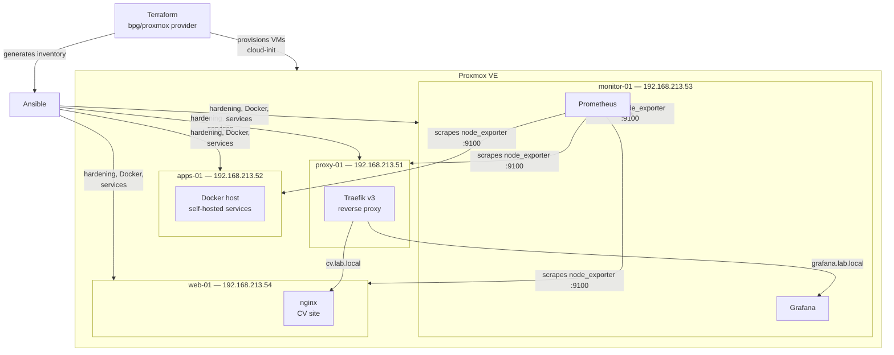
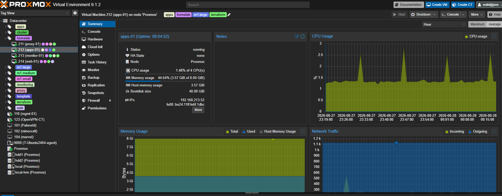
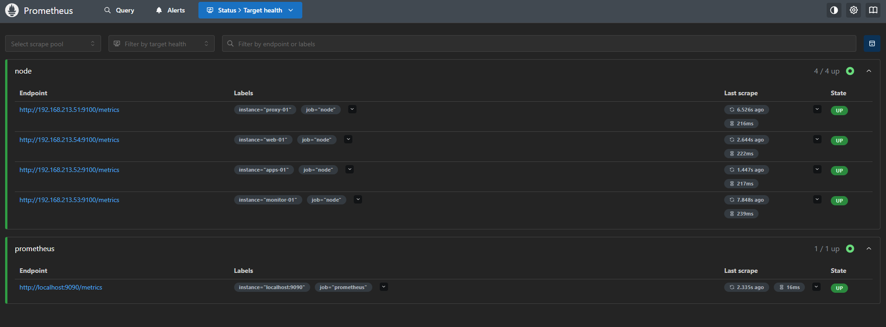
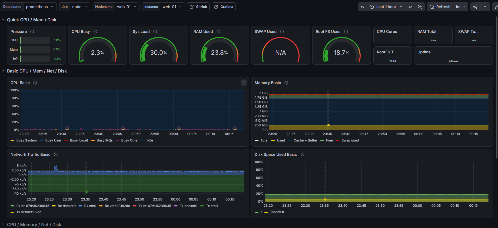
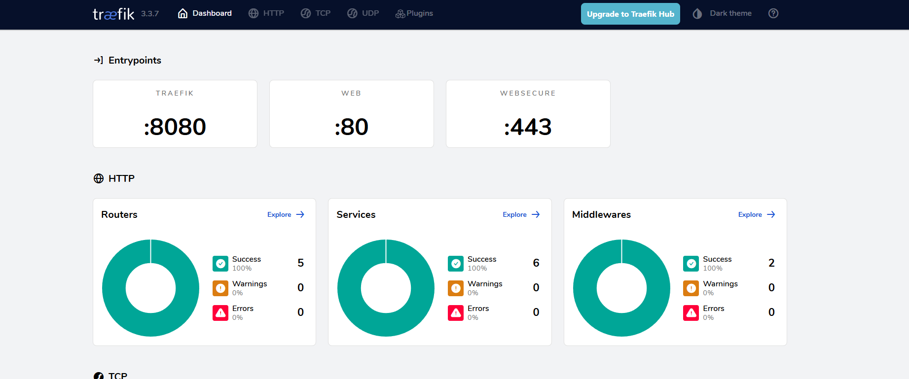
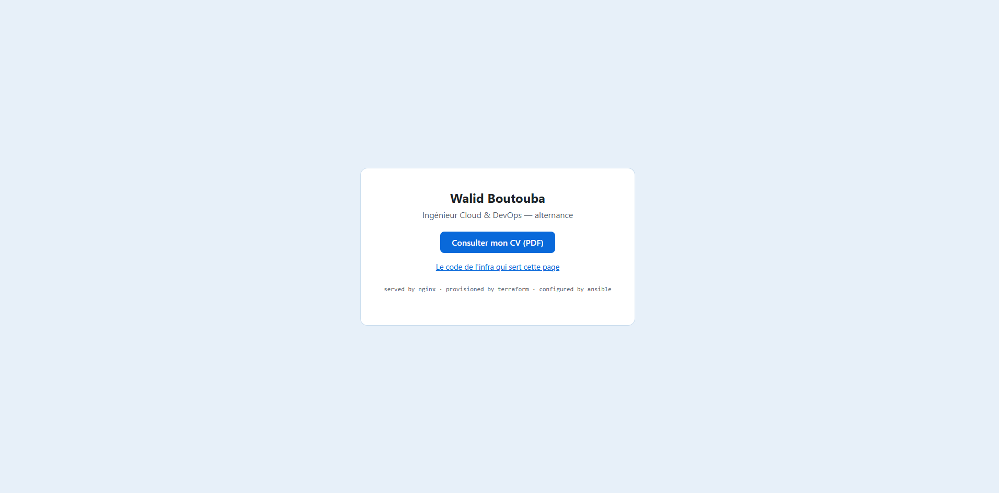

# Homelab Proxmox — Infrastructure as Code

[🇫🇷 Version française](README.fr.md)


End-to-end Infrastructure as Code for my Proxmox homelab: **Terraform** provisions the virtual machines, **Ansible** configures, hardens and deploys the services. One `terraform apply` + one `ansible-playbook` and the whole environment exists — reproducible, versioned, and destroyable at will.

## Architecture



## What it does

**Terraform** (`terraform/`)
- Clones a cloud-init template into 4 VMs (`for_each` over a single `vms` map — adding a machine is 6 lines of HCL)
- OpenStack-style **flavors** (`m1.small` / `m1.medium` / `m1.large`): each VM references a sizing preset instead of hardcoding its resources
- Follows the [bpg/proxmox provider docs](https://registry.terraform.io/providers/bpg/proxmox/latest/docs): recommended `x86-64-v2-AES` CPU type, `stop_on_destroy` for agent-less VMs
- Static IPs, SSH key injection and user creation via cloud-init — no manual step, no password
- **Generates the Ansible inventory** (`local_file` + `templatefile`), so Terraform and Ansible always agree on the machines that exist

**Ansible** (`ansible/`)
- `common` — base packages, timezone, qemu-guest-agent
- `hardening` — SSH key-only auth, no root login, UFW (default deny) with per-group ports, fail2ban, unattended security upgrades
- `node_exporter` — metrics endpoint on every VM
- `docker` — Docker Engine + Compose plugin from the official repository
- `traefik` — reverse proxy with a file-provider config templated from the inventory
- `monitoring` — Prometheus + Grafana via Docker Compose; the scrape config is **templated from the inventory**, so every new VM is monitored automatically
- `cv_site` — nginx serving my résumé behind Traefik (`cv.lab.local`); the PDF itself is deployed by Ansible but git-ignored

**CI** (`.github/workflows/ci.yml`)
- `terraform fmt` + `terraform validate` and `ansible-lint` on every push

## Quickstart

```bash
# 0. One-time Proxmox setup (API token + cloud-init template): see docs/proxmox-setup.md

# 1. Provision the VMs
cd terraform
cp terraform.tfvars.example terraform.tfvars   # fill in endpoint + token
terraform init
terraform apply

# 2. Configure everything
cd ../ansible
ansible-galaxy collection install -r requirements.yml
ansible-playbook site.yml
```

Then open Grafana on `http://192.168.213.53:3000` (or `grafana.lab.local` through Traefik).

## Adding a VM in 30 seconds

```bash
./scripts/newvm.sh add       # interactive: name, id, group, flavor, IP
./scripts/newvm.sh list
./scripts/newvm.sh remove <name>
```

The script maintains `terraform/vms.auto.tfvars.json` (loaded automatically by
Terraform, overrides the default `vms` map) and offers to run
`terraform apply` + `ansible-playbook` right away. The new VM is cloned,
hardened, gets Docker and shows up in Prometheus/Grafana — without touching
a single file by hand.

## Repository layout

```
├── scripts/              # newvm.sh — interactive add/remove/list of VMs
├── terraform/            # VM provisioning (bpg/proxmox)
│   └── templates/        # Ansible inventory template
├── ansible/
│   ├── site.yml          # entry point
│   └── roles/            # common, hardening, node_exporter, docker, traefik, monitoring, cv_site
├── docs/                 # Proxmox one-time setup, screenshots
└── .github/workflows/    # CI: terraform validate + ansible-lint
```

## The lab in pictures

The four VMs provisioned by Terraform, with their tags and agent-reported IPs:



Every VM is scraped automatically — the Prometheus config is templated from the inventory:



Node Exporter metrics in Grafana (dashboard 1860):



Traefik routing (grafana / prometheus / cv) and the CV page served by `web-01`:




## Roadmap

- [ ] Packer build of the cloud-init template (replace the manual `qm` steps)
- [ ] HTTPS on Traefik with a local CA
- [ ] Alerting (Alertmanager → Discord webhook)
- [ ] Backups with Proxmox Backup Server
