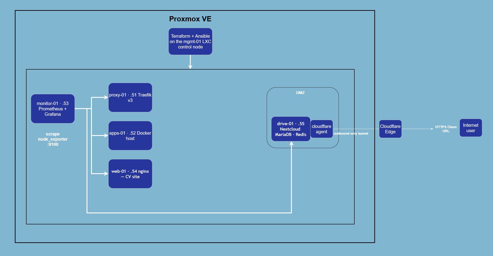

# Homelab Proxmox — Infrastructure as Code

[🇫🇷 Version française](README.fr.md)


End-to-end Infrastructure as Code for my Proxmox homelab: **Terraform** provisions the virtual machines, **Ansible** configures, hardens and deploys the services. One `terraform apply` + one `ansible-playbook` and the whole environment exists — reproducible, versioned, and destroyable at will. It even runs a self-hosted cloud drive, isolated in a DMZ and exposed to the internet through a Cloudflare Tunnel with no open port.

## Architecture




## What it does

**Terraform** (`terraform/`)
- Clones a cloud-init template into VMs (`for_each` over a single `vms` map — adding a machine is a handful of lines)
- OpenStack-style **flavors** (`m1.small` / `m1.medium` / `m1.large`): each VM references a sizing preset instead of hardcoding its resources
- Optional **second data disk** on another datastore (SSD for the OS, HDD for bulk storage)
- Optional **DMZ** flag: opts a VM's NIC into the Proxmox firewall with a per-VM ruleset — inbound limited to web / SSH-from-mgmt / metrics, **outbound to the LAN denied** so a compromised VM cannot pivot
- Follows the [bpg/proxmox provider docs](https://registry.terraform.io/providers/bpg/proxmox/latest/docs): recommended `x86-64-v2-AES` CPU type, agent baked into the template
- Static IPs, SSH key injection and user creation via cloud-init — no manual step, no password
- **Generates the Ansible inventory** (`local_file` + `templatefile`), so Terraform and Ansible always agree on the machines that exist

**Ansible** (`ansible/`)
- `common` — base packages, timezone, qemu-guest-agent (started only when the virtio device is present)
- `hardening` — SSH key-only auth, no root login, UFW (default deny) with per-group ports, fail2ban, unattended security upgrades
- `node_exporter` — metrics endpoint on every VM
- `docker` — Docker Engine + Compose plugin from the official repository
- `traefik` — reverse proxy with a file-provider config templated from the inventory
- `monitoring` — Prometheus + Grafana via Docker Compose; the scrape config is **templated from the inventory**, so every new VM is monitored automatically
- `cv_site` — nginx serving my résumé behind Traefik; the PDF itself is deployed by Ansible but git-ignored
- `drive` — partitions and mounts the HDD data disk, then deploys **Nextcloud** (MariaDB + Redis cache + dedicated cron) plus **cloudflared** for public access; `trusted_domains` / overwrite settings applied idempotently via `occ`

**CI** (`.github/workflows/ci.yml`)
- `terraform fmt` + `terraform validate` and `ansible-lint` on every push

## Quickstart

```bash
# 0. One-time Proxmox setup (API token + cloud-init template): see docs/proxmox-setup.md

# 1. Provision the VMs
cd terraform
cp terraform.tfvars.example terraform.tfvars   # fill in endpoint + token
terraform init
terraform apply

# 2. Configure everything (secrets stay out of git, see ansible/secrets.yml.example)
cd ../ansible
ansible-galaxy collection install -r requirements.yml
ansible-playbook site.yml -e @secrets.yml
```

Then open Grafana on `http://192.168.213.53:3000` (or `grafana.lab.local` through Traefik).

## Adding a VM in 30 seconds

```bash
./scripts/newvm.sh add       # interactive: name, id, group, flavor, IP, data disk, DMZ
./scripts/newvm.sh list
./scripts/newvm.sh remove <name>
```

The script maintains `terraform/vms.auto.tfvars.json` (loaded automatically by
Terraform, overrides the default `vms` map) and offers to run `terraform apply`
followed by a **targeted** Ansible run (`--limit new-vm,monitoring,proxy`) so
adding a machine stays fast no matter how many hosts exist. The new VM is cloned,
hardened, gets Docker and shows up in Prometheus/Grafana — without touching a
single file by hand.

## Security

- **DMZ isolation** — the internet-facing drive VM is firewalled at the Proxmox
  level (outside the guest, so it holds even if the guest is compromised):
  inbound is limited to what it needs, and outbound to the LAN is dropped, so a
  breach of the drive cannot reach the other machines.
- **No open inbound port** — the drive is published through a Cloudflare Tunnel
  (outbound-only connection); the home IP stays hidden and there is no port
  forward to attack. TLS is terminated at Cloudflare's edge.
- **Hardened by default** — key-only SSH, no root login, UFW default-deny,
  fail2ban, and unattended security upgrades on every VM.
- **Verified externally** — the exposed Nextcloud scores **A+** on the official
  [Nextcloud Security Scan](https://scan.nextcloud.com), **A+** on
  [Qualys SSL Labs](https://www.ssllabs.com/ssltest/), and **A+** on
  securityheaders.com (HSTS, CSP, secure cookies, 2FA enforced).

## Lessons learned

Real problems solved while building this — the debugging is half the value:

- **RAID controller froze on writes.** Four parallel full clones hung the HP
  Smart Array P420i. Root cause: the SSD array had **HPE SSD Smart Path** on
  with the write cache disabled, so every write went straight to disk. Fixed
  with `ssacli` (`ssdsmartpath=disable`, `arrayaccelerator=enable`); switched
  the lab to **linked clones** (seconds instead of 15+ minutes per VM).
- **A stray NAT rule broke firewall source matching.** The DMZ SSH rule "allow
  from mgmt" kept dropping traffic. The firewall log showed the packets arriving
  with the *host's* IP: a leftover `POSTROUTING ... MASQUERADE` in
  `/etc/iptables/rules.v4` was rewriting every bridged packet's source. Removing
  it restored correct per-source filtering.

## Repository layout

```
├── scripts/              # newvm.sh — interactive add/remove/list of VMs
├── terraform/            # VM provisioning + per-VM DMZ firewall (bpg/proxmox)
│   └── templates/        # Ansible inventory template
├── ansible/
│   ├── site.yml          # entry point
│   ├── secrets.yml.example
│   └── roles/            # common, hardening, node_exporter, docker,
│                         #   traefik, monitoring, cv_site, drive
├── docs/                 # Proxmox setup, best practices, screenshots
└── .github/workflows/    # CI: terraform validate + ansible-lint
```

## The lab in pictures

The VMs provisioned by Terraform, with their tags and agent-reported IPs:


Every VM is scraped automatically — the Prometheus config is templated from the inventory:


Node Exporter metrics in Grafana (dashboard 1860):


Traefik routing and the CV page served by `web-01`:


## Best practices

The conventions this lab follows (single source of truth, targeted Ansible runs, replace rules, exposure/DMZ, storage lessons): [docs/best-practices.fr.md](docs/best-practices.fr.md) 🇫🇷

## Roadmap

- [x] End-to-end Terraform provisioning + Ansible configuration, with CI
- [x] OpenStack-style flavors and a one-command VM helper
- [x] Self-hosted drive (Nextcloud) in a DMZ, exposed via Cloudflare Tunnel
- [ ] Packer build of the cloud-init template (replace the manual `qm` steps)
- [ ] Manage the Cloudflare settings (TLS, HSTS, WAF) with the Terraform Cloudflare provider
- [ ] Alerting (Alertmanager → Discord webhook)
- [ ] Backups with Proxmox Backup Server
